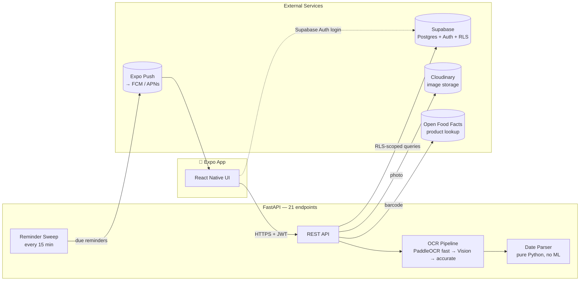

# Architecture — Pantry & Cosmetics Expiry Guardian

*MUMTEC x GDGoC MUM x Averis Hackathon — Practical AI Solutions for Real-World Impact*

Households throw out expired toiletries, medicine and food because tracking
expiry dates by hand is tedious. This app lets someone photograph a product
label; the backend extracts the expiry date via OCR, prioritises reminders by
what's expiring soonest, and gives usage or safe-disposal guidance —
addressing **SDG 12 (Responsible Consumption)** and **SDG 3 (Good Health)**.

This document covers the **backend** (FastAPI + Supabase + PaddleOCR). The
mobile frontend (React Native + Expo) is a separate codebase built by a
teammate against the contract in [`docs/api.md`](api.md).

---

## System overview



The app never talks to Supabase for pantry data directly — only for
authentication. Every read and write of `items`, `scans`, and `reminders`
goes through the backend, which holds the service-role key, the OCR models,
and the reminder-scheduling logic the client never sees.

---

## Why this stack

| Choice | Why |
|---|---|
| **FastAPI (Python)** | PaddleOCR is Python-native; async I/O suits many small Supabase round trips |
| **Supabase (Postgres)** | Row-Level Security enforces per-user isolation *in the database*, not just in application code — verified with real attack tests (below) |
| **PaddleOCR, tiered** | Handles Malay/Chinese label text; a fast/accurate two-tier chain cuts typical scan time from ~14s to ~3s (see *OCR pipeline*) |
| **Google Cloud Vision** | Fallback engine behind the same interface as PaddleOCR — live and verified; 5/7 correct alone on the real fixtures (weaker than PaddleOCR on one low-contrast, reflective label), so it stays a fallback rather than primary, but the full pipeline with it included still reads 6/7 with zero regression |
| **Cloudinary** | Label photo storage; scans still succeed if it's unreachable (best-effort) |
| **Expo Push → FCM/APNs** | Frontend's choice; backend never touches raw FCM tokens |

---

## The product's core differentiator: effective expiry

The printed date on a cosmetic is not always the date it becomes unsafe.
Sunscreens, in particular, carry a **period-after-opening** (PAO) symbol —
"12M" means unsafe 12 months after opening, regardless of the printed date.

```sql
effective_expiry_date date generated always as (
  least(expiry_date, (opened_at + make_interval(months => pao_months))::date)
) stored
```

Every sort, urgency bucket, reminder, and piece of disposal guidance reads
`effective_expiry_date`, never the printed date. A sunscreen printed for
**2028** that was opened seven months ago is correctly shown as **expired
today** — the single detail no simple "expiry tracker" app gets right.

---

## OCR pipeline: measured, not assumed

Every claim below was benchmarked against real, photographed product labels
in `backend/tests/fixtures/labels/` — not synthetic text.

```
fast PaddleOCR (mobile detector)   →  4/5 real labels,  ~3.5s
      │ escalates only on low confidence or no date found
      ▼
Google Vision (cloud, ~1-2s)       →  5/7 real labels, alone
      │ escalates only if still unresolved
      ▼
accurate PaddleOCR (server detector) → 5/5,            ~14s
```

Chaining fast-then-accurate keeps the common case fast (most scans resolve on
the first tier in 2–4s) while still recovering the hard cases. Vision runs
before the accurate tier, not after: both are only reached when fast tier
isn't good enough, and Vision is a ~1-2s cloud call against the accurate
tier's own local detector, measured at 14s under normal load and well over
100s under real memory pressure. Verified against all 7 real fixtures that
this ordering never costs accuracy — the pipeline always keeps the best-
scoring result across every engine actually tried, not just whichever ran
first, so a fast engine trying (and failing) before a slow one only ever
saves time. Every scan records `engines_attempted` — which tier ran, its
confidence, whether it found a date — so the escalation is auditable
per-request, not asserted.

**Real accuracy claims, both true and both worth stating precisely:**
- **7/7** at the parser level (clean printed text → correct date)
- **6/7** through the full OCR pipeline on real photos — one fixture (an
  embossed, no-ink toothpaste-tube date) is a documented, currently-unsolved
  OCR limitation, kept as an `xfail` rather than hidden or excluded

The ~3.5s fast-tier figure above is a local Windows-dev-machine measurement.
PaddlePaddle's oneDNN path turned out to be broken on Linux too, not just
Windows as first assumed — verified live on Cloud Run, every real scan hit
`(Unimplemented) ConvertPirAttribute2RuntimeAttribute not support` on both
tiers and silently fell back to Vision every time. Disabling oneDNN fixed
it (confirmed: fast tier now genuinely succeeds in production), but costs
real speed — measured at ~17s on Cloud Run for the same fixture that took
~3.5s locally. A tier that works at 17s is still strictly better than one
that always failed in 250ms and contributed nothing.

**The parser never guesses.** A six-digit date with no separator
(`EXP:210827`) is genuinely ambiguous between DD-MM-YY and YY-MM-DD — both
conventions exist in the wild — so it's returned with both readings and
flagged for the user to confirm. A pack printing only a *manufacture* date
returns `expiry_date: null`, however confident the read: reporting it as an
expiry would tell someone their item expired months ago.

**Barcodes carry identity, not dates.** Retail EAN-13/UPC codes encode a
product identifier only; the expiry always comes from OCR of printed text.
The two paths run concurrently (`asyncio.gather`) and merge in one scan
response. 7/7 real barcode photos decode correctly, including correctly
rejecting a non-retail CODE128 code and preferring an EAN-13 over a QR code
photographed in the same frame.

---

## Security

- **Every user table has Row-Level Security.** Verified with two real
  accounts, not just policy inspection: cross-user reads, writes, updates and
  deletes were attempted and confirmed blocked (`42501`) at the database
  layer.
- **JWT verified via Supabase's JWKS** (ES256), not a shared secret.
- **The service-role key never reaches a user-facing route** — reserved for
  the reminder sweep and reference-data writes, enforced by code review
  convention (`app/db/client.py`).
- Disposal guidance for medicine and chemicals is **curated, not
  LLM-generated** — every `hazard`-severity row cites a real published
  source (Malaysia's MOH Return Your Medicines Programme; US EPA guidance),
  because "where does this come from?" is a question a judge can ask.

---

## Data model

8 tables, 4 migrations, RLS on every user-owned one:

`profiles` · `categories` · `products` (shared barcode cache) · `scans`
(OCR audit trail, separate from items) · `items` · `reminders` ·
`devices` · `disposal_guidance` (15 seeded rows, English + Malay)

`scans` is deliberately not merged into `items`: OCR misreads, users retry,
and a low-confidence read shouldn't become a pantry entry without
confirmation. `reminders` carries `UNIQUE(item_id, kind)` so a retried sweep
can never send the same notification twice.

---

## API

21 endpoints under `/v1`, documented in [`docs/api.md`](api.md) — the
contract the frontend was built against, with real captured response
samples in `docs/api-samples/` so the app could be built before the
backend was reachable.

Every error shares one envelope (`{"error": {"code", "message", "details"}}`),
so the client branches on a stable code, never on message text.

---

## Reminders

Scheduled against **the user's own timezone and quiet hours**, not the
server's clock — a reminder fires at 09:00 local, not 09:00 UTC (which in
Kuala Lumpur is five in the afternoon). Quiet hours correctly wrap midnight.
Reminders hang off `effective_expiry_date`, so the PAO-lapsed sunscreen
above gets reminded on time despite its printed date being years out.

The sweep is an HTTP endpoint (`POST /v1/internal/reminders/sweep`), called
every 15 minutes by an external scheduler — Cloud Run scales to zero, so an
in-process timer would simply never fire. Verified against the real Expo
push API, including the failure path: a dead token correctly returns
`DeviceNotRegistered` and is pruned automatically rather than retried forever.

---

## Testing

**197 tests passing** in the default run, against the live Supabase project,
not mocks — RLS isolation, the OCR pipeline, barcode decoding, and reminder
scheduling are all exercised end-to-end. A further 8 tests, marked `slow`
because they invoke the real PaddleOCR models directly, run separately (7
passing, 1 honestly `xfail`ed — the documented embossed-date limitation
above). Fixture-driven: every recorded label and barcode becomes a test case
automatically, so adding a new photo adds coverage with no code change.

---

## Deployment — the honest version

Currently served over a **Cloudflare Tunnel** from a development machine,
not Cloud Run — GCP billing is now active on the project, but Cloud Run
itself hasn't been deployed yet. `backend/scripts/deploy.ps1` is written,
idempotent, and moves secrets into Secret Manager rather than environment
flags — ready to run. Until it's actually deployed, `serve-public.ps1` runs
the same container image logic locally and exposes it publicly, including
the 15-minute reminder sweep.

**Google Cloud touchpoints:** Cloud Run (scripted, not yet deployed), Cloud
Scheduler (scripted, not yet deployed — a local loop stands in for now),
Cloud Vision (live — see the OCR pipeline section above), Firebase Cloud
Messaging (live, via Expo's push service).

---

## What's next

The one feature not yet built end-to-end is the camera screen on the
frontend — every backend endpoint it needs already exists and is tested.
